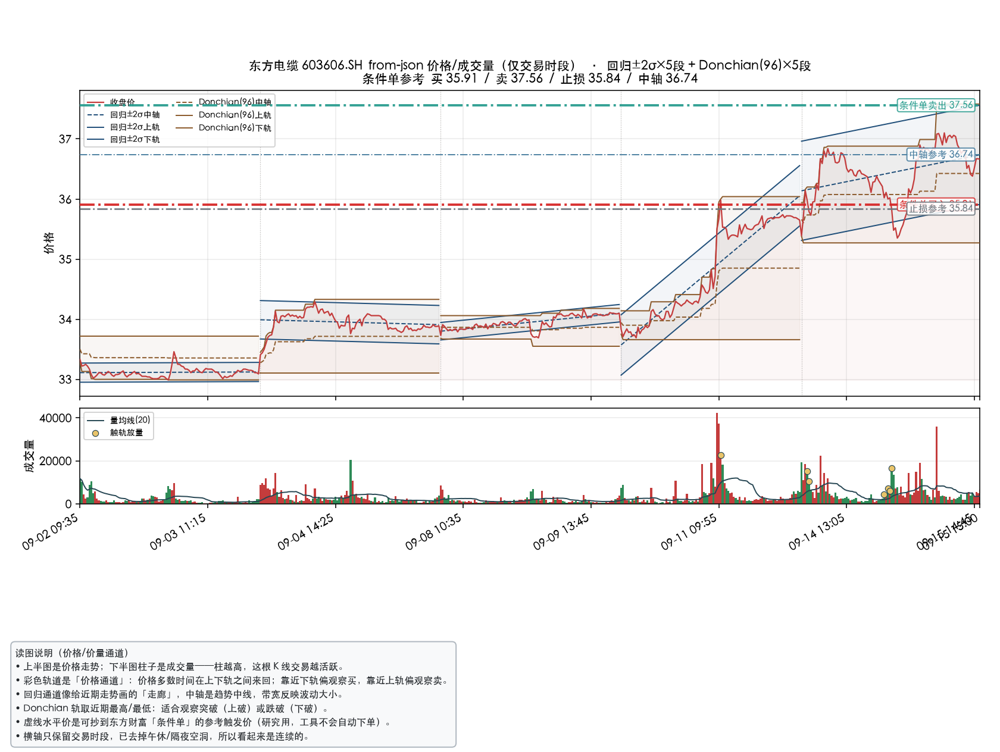
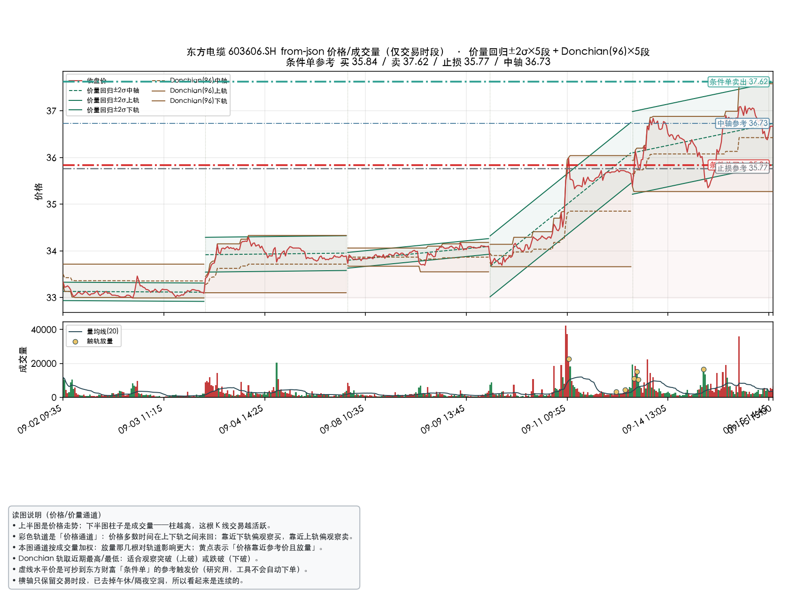
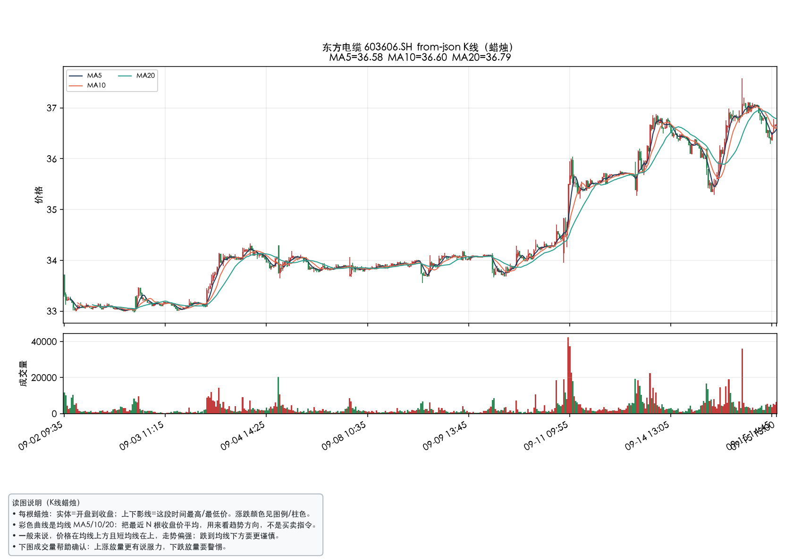
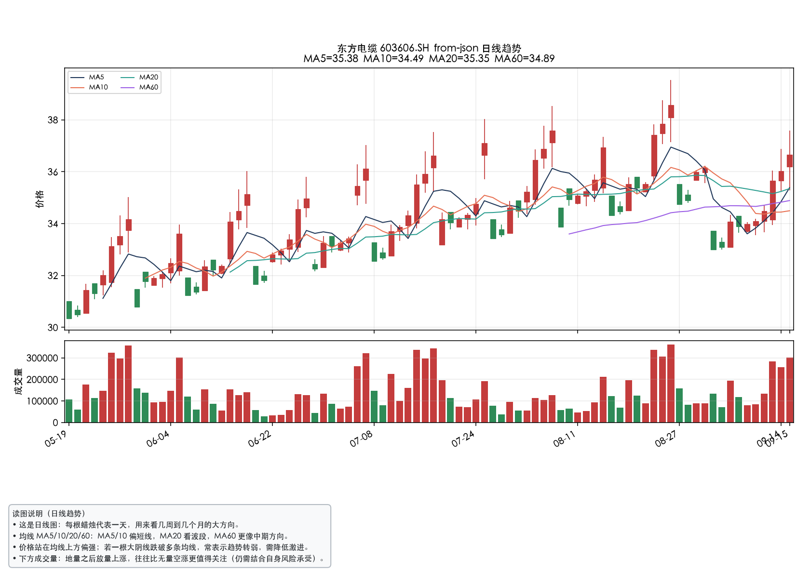
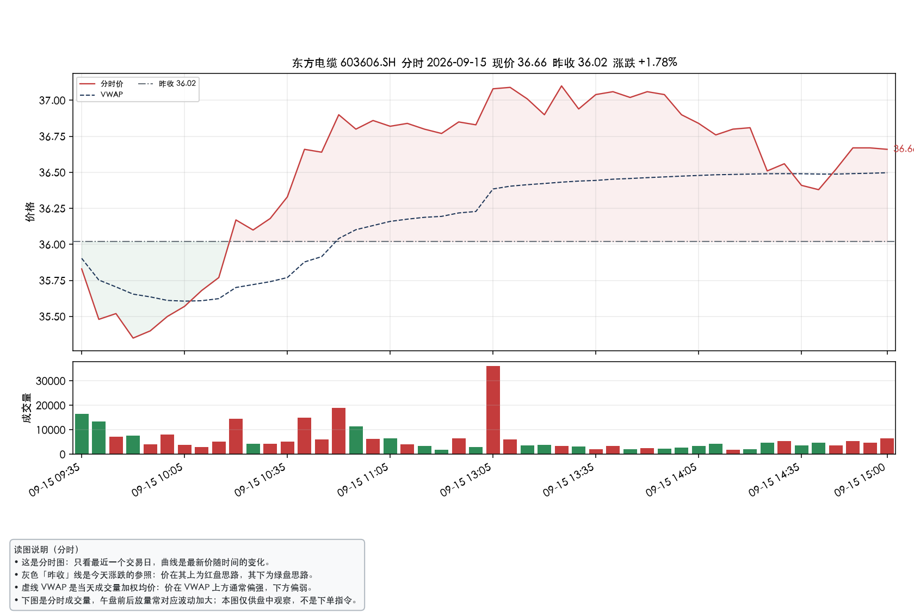

# emquote — 东方财富公开行情只读 CLI

独立小工具：调用东方财富网站公开 HTTP 接口（与 [AKShare](https://github.com/akfamily/akshare) 同类），拉取 A 股**报价 / K 线**，并可画出**价格 + 成交量 + 多通道**，以及**条件单买卖参考价**（人工录入东财，工具不下单）。

- **只读研究**。无下单、无券商登录。
- **非官方**，无 SLA；节点可能限流或短暂断连。
- **不是** Choice / OpenAPI（官方量化接口需付费终端：[quantapi.eastmoney.com](https://quantapi.eastmoney.com/)）。

## 安装

```bash
cd ~/projects/eastmoney-api
python3 -m venv .venv
source .venv/bin/activate
pip install -e '.[plot]'
```

之后任意目录：

```bash
emquote --help
```

## 给 AI / 脚本调用的画图 CLI

安装 `.[plot]` 后提供五个**独立命令**（参数少、预设固定，适合 agent 直接调用）。
每张图底部都会带一段「读图说明」，用白话解释通道/均线/分时等含义，方便非技术读者：

| 命令 | 画什么 | 默认 |
|---|---|---|
| `emplot-channel` | 价格通道图 + 条件单买/卖/止损 | 通道 `reg,donchian`，5m×10日 |
| `emplot-pv` | 价量通道图 + 量均线/触轨放量 + 条件单 | 通道 `vwreg,donchian`，5m×10日 |
| `emplot-kline` | K 线蜡烛图 + MA5/10/20 + 成交量 | 5m×10日 |
| `emplot-daily` | 日线趋势 + MA5/10/20/60 + 成交量 | 1d×120日 |
| `emplot-intraday` | 分时价 + VWAP + 昨收 + 成交量 | 1m×最近交易日 |

```bash
# 在线
emplot-channel 603606.SH -o channel.png
emplot-pv 603606.SH -o price-volume.png
emplot-kline 603606.SH -o kline.png
emplot-daily 603606.SH -o daily.png
emplot-intraday 603606.SH -o intraday.png

# 离线样例
emplot-channel --from-json examples/sample-603606-5m.json --days 10 -o channel.png
emplot-pv --from-json examples/sample-603606-5m.json --days 10 -o price-volume.png
emplot-kline --from-json examples/sample-603606-5m.json --days 10 -o kline.png
emplot-daily --from-json examples/sample-603606-1d.json -o daily.png
emplot-intraday --from-json examples/sample-603606-5m.json -o intraday.png

# AI 友好：JSON 摘要（图仍会保存）
emplot-daily 603606.SH -o out.png --json
```

也可写成子命令：`emquote plot-channel|plot-pv|plot-kline|plot-daily|plot-intraday ...`。


## 常用命令

```bash
# 实时报价
emquote quote 603606.SH
emquote quote 002223.SZ --json

# 最近 10 个交易日 · 5 分钟 K 线（成交价序列）
emquote kline 603606.SH -i 5m --days 10
emquote kline 603606.SH -i 5m --days 10 --csv > bars.csv
emquote kline 603606.SH -i 1d --days 30

# 通用画图（自选通道）：上价格下成交量
# vwreg = 成交量加权回归通道（同时考虑价格与量）
emquote plot 603606.SH -i 5m --days 10 --channel vwreg,donchian --channel-window 96 -o out.png
# 默认按窗口自动切成多段覆盖全时段，并把条件单买/卖/止损画在图上
# 若只要最近一段：加 --single-window

# 条件单参考价：打印买入/卖出/止损触价，便于抄到东方财富条件单（不下单）
emquote levels 603606.SH -i 5m --days 10 --channel vwreg,donchian --channel-window 96
```

周期：`1m` `5m` `15m` `30m` `60m` `1d` `1w` `1mo`。  
复权：`--adjust none|qfq|hfq`。  
全局参数：`--timeout`、`--retries`（写在子命令前面）。

离线样例（`push2his` 暂时不通时）：

```bash
emquote kline --from-json examples/sample-603606-5m.json --days 10
emquote plot --from-json examples/sample-603606-5m.json --days 10 -o demo.png
emplot-channel --from-json examples/sample-603606-5m.json --days 10 \
  -o examples/demo-603606-5m-10d.png
emplot-pv --from-json examples/sample-603606-5m.json --days 10 \
  -o examples/demo-603606-5m-price-volume.png
```

示例图：

价格通道（`emplot-channel`）：



价量通道（`emplot-pv`）：



K 线蜡烛（`emplot-kline`）：



日线趋势（`emplot-daily`）：



分时（`emplot-intraday`）：




## 发到 GitHub，建议具备的基础能力

| 能力 | 本仓库 | 说明 |
|---|---|---|
| `quote` 实时快照 | ✅ | 代码、名称、最新价、时间 |
| `kline` 多周期 | ✅ | 含「最近 N 日 × 5 分钟」 |
| `emplot-channel` | ✅ | 价格通道图独立 CLI（AI 调用） |
| `emplot-pv` | ✅ | 价量通道图独立 CLI（AI 调用） |
| `emplot-kline` | ✅ | K 线蜡烛图独立 CLI（AI 调用） |
| `emplot-daily` | ✅ | 日线均线趋势独立 CLI（AI 调用） |
| `emplot-intraday` | ✅ | 分时图独立 CLI（AI 调用） |
| `plot` 价格/成交量图 | ✅ | 上价格、下成交量；可叠加 reg/vwreg/donchian/hl |
| `levels` 条件单参考价 | ✅ | 给出买入/卖出/止损触价，人工录入东财 |
| JSON / CSV | ✅ | 方便接 pandas / 其它脚本 |
| 多主机 + 重试 | ✅ | `push2` / `push2delay` / `push2his*` |
| `pip install` 入口 | ✅ | 控制台命令 `emquote` |
| 中文 README + MIT | ✅ | 写清非官方 / 只读 / 限流 |
| 名称搜索 / 自选批量 | ❌ | 可后续加，别一上来做重 |
| 本地行情缓存 | ❌ | 需要时再加；勿缓存任何密钥 |

结论：**可以、也适合**做成独立 GitHub 项目。先把「装得上、调得动、画得出」做稳，再考虑批量与缓存。

## 接口

| 用途 | URL |
|---|---|
| 报价 | `https://push2.eastmoney.com/api/qt/stock/get`（失败回退 `push2delay`） |
| K 线 | `https://push2his.eastmoney.com/api/qt/stock/kline/get`（含编号节点回退） |

`secid`：沪市 `1.代码`，深/北 `0.代码`。K 线参数里的 `ut` 是网站公开固定值，**不是用户密钥**。

## 限制

- 非官方，路径/字段可能改版。
- 有反爬与限流；不要高频扫全市场。
- 部分网络对 `push2his` 会直接断连（本机偶发）；可重试、换网络，或用 `--from-json` 验证画图链路。
- 数据仅供个人研究，许可以东方财富网站条款为准。
